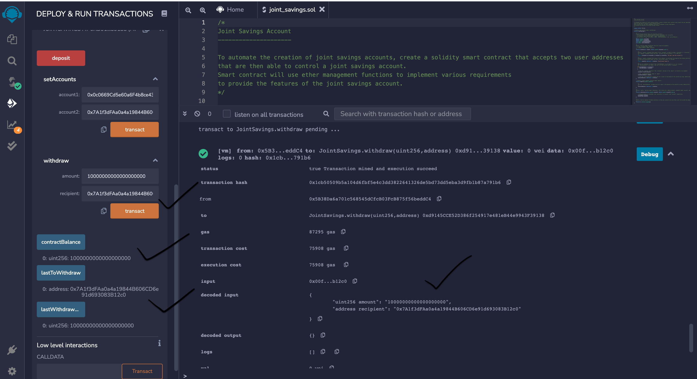

# Joint Savings Account Smart Contract

A Solidity smart contract that accepts two user addresses which will be able to control a joint savings account. Smart contract will use ether management functions 

## Process:

The high level steps for writing, compiling and deploying the `Smart Contract` in `Remix IDE` using `Solidity` are as follows:
 
1. Create a Joint Savings Account Contract in Solidity

2. Compile and Deploy the Contract in the JavaScript VM

3. Interact with Deployed Smart Contract

### Deployed Smart Contract:

## Testing:

### 1. Using the `setAccounts` function.

### 2. Testing the `deposit` functionality of smart contract: 

* Transaction 1: Send 1 ether as wei.

* Transaction 2: Send 10 ether as wei.

* Transaction 3: Send 5 ether.

### Testing the contract’s `withdrawal` functionality:

* Transaction 1: Withdrawing 5 ether into accountOne.

* Transaction 2: Withdrawing 10 ether into accountTwo.

## Technologies

This application leverages python 3.7 with the following modules

* Remix IDE - An open source web and desktop application, allows developing, deploying and administering smart contracts for Ethereum like blockchains.
* Solidity - An object-oriented, high-level language for implementing smart contracts.
* Ganache - A personal blockchain for rapid Ethereum application development and testing Apps

## Installation Guide

Remix IDE, Click[Here](https://remix.ethereum.org/#optimize=false&runs=200&evmVersion=null&version=soljson-v0.8.7+commit.e28d00a7.js)

Ganache Installation, Click[Here](https://trufflesuite.com/docs/ganache/quickstart/)

## Contributor

Shivangi Gupta

## License

MIT

